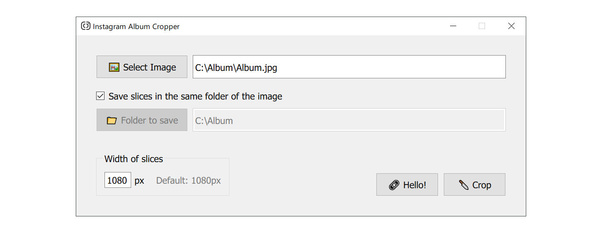
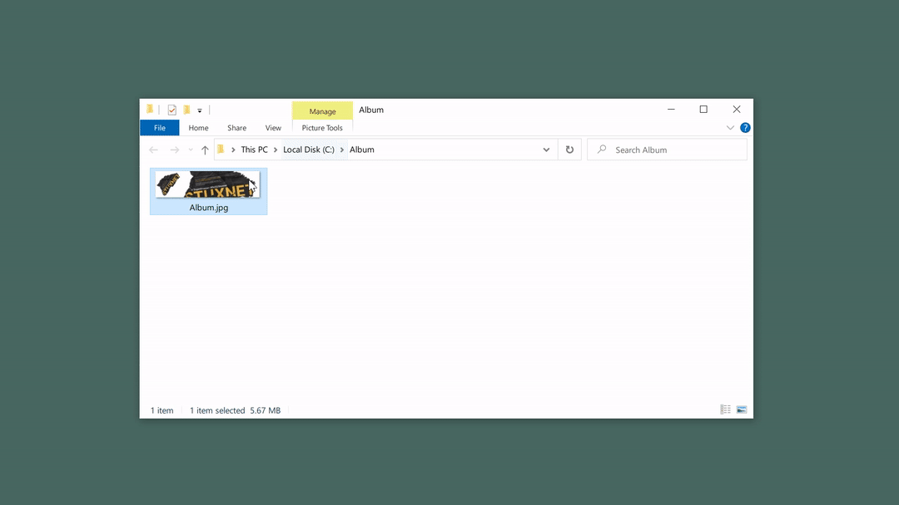

Made by [**martyr—**](https://martyr.shop) // Logo by [**mönk**](https://www.instagram.com/monkstudeyo/)

### [**Download**](#download)
For Windows and macOS

If you find yourself making carousel albums for Instagram, **you need this.**

*Are you tired of setting guides layouts, making the pixel perfect selection to make slices, and then exporting each one, making sure every setting is the same in the export panel in Photoshop?*

*A moment of silence for Illustrator users ⚰️*

This tool will definitely simplify your workflow. Try it. It's free. 

## What it does?

**It crops an image horizontally in a given width. Just that.**
- You can customize that width if you want it
- Height remains the same as the source picture.
- JPG and PNG with transparency compatible.
- Simple and Fast
- For Windows and macOS

## Download
Version is 1.0 — Released 10 Jan 2021

### Windows

### macOS

*In progress*

## How to Use

1. Save the whole Instagram Album as one long image in your prefered editor 
2. Open this app
3. Load the image
4. Click `🔪 Crop`

Of course, you can find it useful for other use-cases, such as cropping images for printing purposes. Use it at your will!
